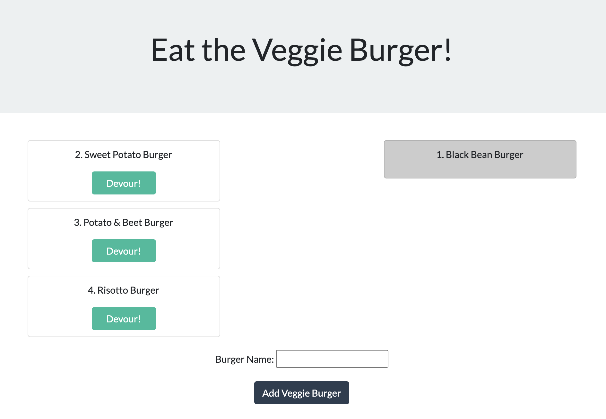

# Eat the Veggie Burger

## Deployed

[Access the deployed web application here.](https://eat-the-veggie-burger.herokuapp.com/)

## Purpose

This fun restaurant app allows users to submit veggie burgers they'd like to eat. All veggie burgers start on the left side of the page, waiting to be devoured. When a user clicks "Devour," the veggie burger moves to the right side. All burgers, whether devoured or not, are stored in a database.

## Tech

* HTML
* CSS
* JavaScript
* jQuery
* Node.js
* Express.js
* MySQL

